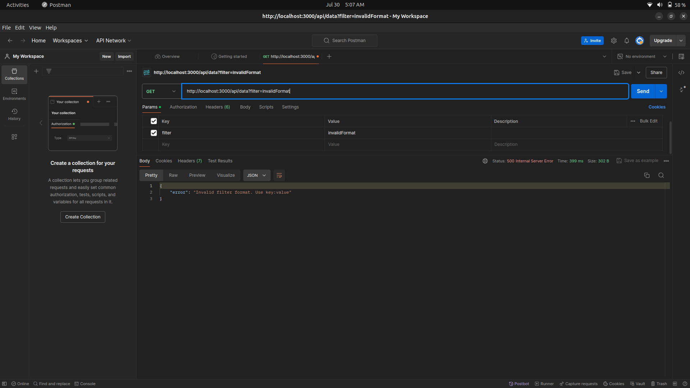
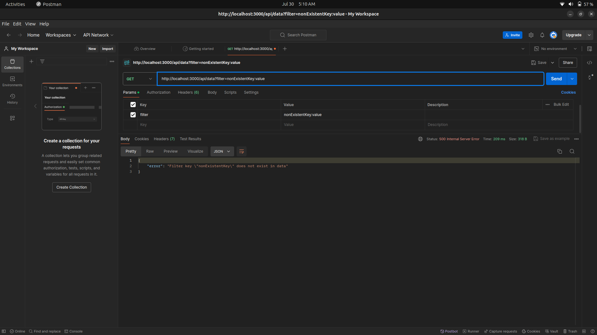
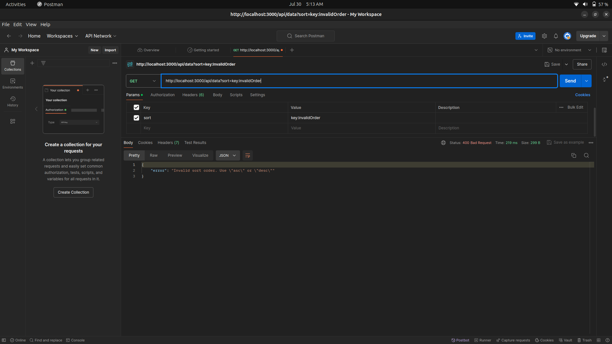

**Node.js Data Fetching, Filtering, and Sorting API**

**Project Description**

This Node.js application fetches data from an external API and provides endpoints to filter and sort the fetched data using query parameters. The project emphasizes clean code, logical structure, robust error handling, and comprehensive documentation.

**Features**

* Fetches data from an external API
* Filters data based on query parameters
* Sorts data based on query parameters
* Implements comprehensive error handling
* Includes clear project structure and documentation
* **Project Depth and Complexity:**
    * Delves deeper into the technical implementation, explaining the core logic behind filtering and sorting, the data structures used, and any algorithmic optimizations.
    * Provides details about the external API you're using, its limitations, and how you handled potential issues.
* **Code Quality and Testing:**

    * To ensure code quality and reliability, I employed the following practices:

    * Linting: Used ESLint with a strict configuration to enforce consistent code style and catch potential errors early in the development process.
    * Testing: Implemented comprehensive unit tests using Jest to verify the correct functionality of individual components and edge cases. Additionally, integration tests were written to ensure seamless interaction between different parts of the application.
    * By following these practices, I was able to maintain code readability, prevent common errors, and increase confidence in the application's correctness.

* **Performance Optimization:**
    * Data Pagination: Implementing pagination to fetch data in smaller chunks, improving load times and user experience.
    * Caching: Caching frequently accessed data to reduce API calls and database queries.
    * Asynchronous Operations: Utilizing asynchronous programming to handle multiple requests concurrently and prevent blocking operations.

* **Additional Features:**
    * Considers adding features to showcase your problem-solving and development skills, such as pagination for large datasets, caching to improve performance, advanced filtering options (e.g., full-text search, range-based filtering), and security considerations (e.g., input validation, rate limiting).
* **Deployment and Scalability:**
    * Briefly mentions how you would deploy the application to a production environment (e.g., using platforms like Heroku, AWS, or Docker).
    * Discusses potential scalability challenges and how you would address them.
* **Visuals:**
    * Basic operations (These are the basic examples)

        * Fetch Data 
            file:///home/aayush/Pictures/Screenshots/Screenshot%20from%202024-07-30%2004-57-06.png     

        * Fetch and filter data
            file:///home/aayush/Pictures/Screenshots/Screenshot%20from%202024-07-30%2004-57-42.png

        * Fetch and sort data
            file:///home/aayush/Pictures/Screenshots/Screenshot%20from%202024-07-30%2004-58-14.png

        * Fetch, filter, and sort data
            file:///home/aayush/Pictures/Screenshots/Screenshot%20from%202024-07-30%2004-58-57.png

    * Tests (These are the basic examples)
        * Invalid filter format
            

        * Non-existent filter key
            

        * Invalid sort format
            

        * Invalid sort order
            
            
    
**Getting Started**

**Prerequisites**

* Node.js (version 18.13.0 or later)
* npm (version 8 or later)

**Installation**

1. Clone the repository to your local machine.
2. Navigate to the project directory.
3. Run `npm install` to install dependencies.

**Running the Project**

* Start the server using `node app.js`.
* The server will be running at `http://localhost:3000`.

**API Endpoints**

**Fetch, Filter, and Sort Data**

* **URL:** `http://localhost:3000/api/data`
* **Method:** GET
* **Query Parameters:**
    * `filter`: Filter data by a specific key and value in the format `key:value`.
    * `sort`: Sort data by a specific key and order in the format `key:order` (order can be `asc` or `desc`).

**Examples:**

* Fetch and filter data: `http://localhost:3000/api/data?filter=language:Sindhi`
* Fetch and sort data: `http://localhost:3000/api/data?sort=version:asc`
* Fetch, filter, and sort data: `http://localhost:3000/api/data?filter=language:Sindhi&sort=version:asc`

**Error Handling**

The API returns appropriate error messages and status codes for various error scenarios, including:

* Fetch failures
* Invalid filter or sort formats
* Non-array data fetched from the API

**Project Structure**

* `src`: Contains the source code.
    * `routes`: Contains route handlers.
        * `dataRoutes.js`: Handles data fetching, filtering, and sorting requests.
    * `dataService.js`: Contains functions for fetching and processing data.
    * `logger.js`: Configures the logger for error logging.
    * `app.js`: Sets up and starts the Express server.

**Code Quality and Documentation**

* Inline comments and JSDoc annotations are used for code clarity.
* Detailed API documentation is provided above.
* Error handling scenarios are demonstrated with example URLs:
    * Invalid filter format: `http://localhost:3000/api/data?filter=invalidFormat`
    * Non-existent filter key: `http://localhost:3000/api/data?filter=nonExistentKey:value`
    * Invalid sort format: `http://localhost:3000/api/data?sort=invalidFormat`
    * Invalid sort order: `http://localhost:3000/api/data?sort=key:invalidOrder`

**Conclusion**

This project showcases a robust and well-documented Node.js application for fetching, filtering, and sorting data, along with effective error handling.

# NodeJS-project
